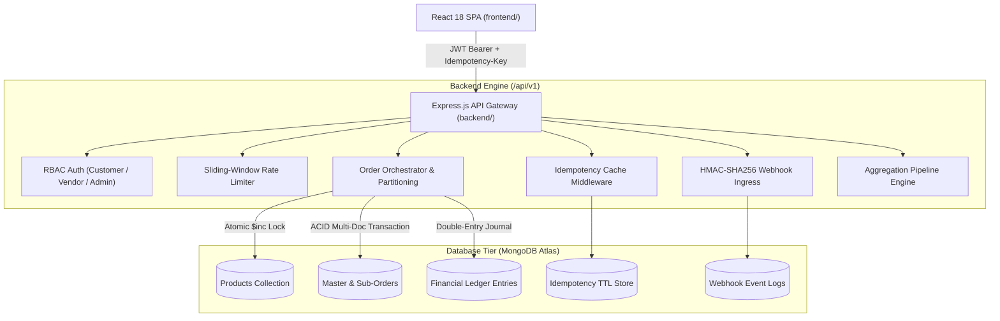

# MarketPulse — Enterprise Multi-Vendor Marketplace & Order Orchestration Engine
> **High-Throughput, Backend-Heavy MERN Stack Platform with Atomic Concurrency Locking, Multi-Vendor Order Partitioning, Cryptographic Webhook Ingress, and MongoDB Aggregation Pipelines.**

[](https://nodejs.org)
[](https://expressjs.com)
[](https://www.mongodb.com)
[](https://reactjs.org)
[](https://vitejs.dev)
[](LICENSE)

---

## 🌟 Architectural Highlights & Resume Selling Points

1. **Atomic Inventory Concurrency Locking (Zero-Oversell Guarantee)**
   * Eliminates race conditions during simultaneous flash-sale checkouts using MongoDB atomic condition updates:
     `Product.findOneAndUpdate({ _id: id, stock: { $gte: qty } }, { $inc: { stock: -qty } })`.
   * Backed by Mongoose ACID transaction sessions (`session.withTransaction`) ensuring atomic rollbacks across distributed collections.

2. **Multi-Vendor Order Partitioning & Lifecycle State Machine**
   * A unified multi-vendor customer checkout automatically segments into independent vendor sub-orders.
   * Granular state machine transitions (`PENDING` → `PAID` → `PROCESSING` → `SHIPPED` → `DELIVERED` → `REFUNDED`) with independent carrier tracking numbers.

3. **Double-Entry Financial Ledger & Settlement Engine**
   * Immutable financial audit trail logging every customer debit, vendor proceeds credit, and platform take-rate commission fee.
   * Enables automated vendor payout reconciliation.

4. **Idempotency-Key Header Middleware**
   * Header-based caching (`Idempotency-Key: <UUID>`) with SHA-256 request payload hashing to safely prevent duplicate charges on client retries and network timeouts.

5. **Cryptographic HMAC-SHA256 Webhook Ingress**
   * Secure payment webhook processing with timing-safe HMAC signature verification (`X-MarketPulse-Signature`), replay prevention, and idempotency deduplication.

6. **Complex MongoDB Aggregation Pipelines**
   * Real-time calculation of Gross Merchandise Value (GMV), platform take-rate revenue, vendor sales leaderboards (`$lookup`, `$unwind`, `$group`), and sales velocity trends.

7. **Interactive Concurrency & Security Sandbox**
   * Built-in developer testing playground allowing interviewers to fire 50 simultaneous asynchronous burst requests and inspect live atomic lock guards in real-time.

---

## 🏗️ System Architecture & Workflow



---

## ⚡ Concurrency Control: Why Naive Approaches Fail

### ❌ The Naive Approach (Race Condition Vulnerability):
```javascript
// BUG: Read-then-write race condition
const product = await Product.findById(productId);
if (product.stock >= quantity) {
  // If 50 requests arrive concurrently, ALL 50 will read stock = 2 and proceed!
  product.stock -= quantity;
  await product.save(); // Result: Stock becomes -48 (Catastrophic Overselling!)
}
```

### ✅ The MarketPulse Approach (Atomic Condition Lock):
```javascript
// ATOMIC: Database-level lock guard
const product = await Product.findOneAndUpdate(
  { _id: productId, stock: { $gte: quantity }, isActive: true },
  { $inc: { stock: -quantity } },
  { new: true, session }
);

if (!product) {
  // Exactly 2 succeed, 48 safely rejected with 409 Conflict!
  throw new Error('INSUFFICIENT_STOCK_CONFLICT');
}
```

---

## 🚀 Quick Start & Installation

### 1. Clone & Install Dependencies
```bash
# Install root, backend, and frontend dependencies concurrently
npm run install:all
```

### 2. Environment Configuration
Create `backend/.env` (or use provided defaults):
```env
PORT=5000
NODE_ENV=development
MONGODB_URI=mongodb+srv://<username>:<password>@cluster0.lkee1f1.mongodb.net/marketpulse?retryWrites=true&w=majority
JWT_SECRET=marketpulse_jwt_super_secret_key_2026_production_grade
JWT_EXPIRES_IN=1d
WEBHOOK_SECRET=whsec_marketpulse_hmac_sha256_mock_key_2026
CLIENT_URL=http://localhost:5173
```

### 3. Seed Database & Start Development Server
```bash
# Seed initial vendors, catalog, and ledger
npm run seed

# Run Backend (Port 5000) and Frontend (Port 5173) concurrently
npm run dev
```

### 4. Run Automated Concurrency Verification Suite
```bash
npm run test:concurrency
```

---

## 📮 Postman Collection

Import the included `marketpulse_postman_collection.json` into Postman. It comes pre-configured with:
- **1-Click Demo Logins** (Admin, Tech Vendor, Artisan Vendor, Shopper)
- **Automatic JWT Token Injection** across all requests
- **Faceted Product Search Queries**
- **Idempotency Header Test Requests**
- **HMAC Signed Webhook Delivery Tests**
- **Concurrency Stress Test Endpoints**

---

## 👥 Demo Accounts (1-Click Switcher Available in UI)

| Role | Email | Password | Store Name | Take-Rate |
| :--- | :--- | :--- | :--- | :--- |
| **Super Admin** | `admin@marketpulse.io` | `Password123!` | *Platform Wide* | 100% Audit |
| **Tech Vendor** | `vendor.tech@marketpulse.io` | `Password123!` | Apex Robotics & Gear | 10% |
| **Artisan Vendor** | `vendor.artisan@marketpulse.io` | `Password123!` | Kuro Studio Crafted | 12% |
| **Shopper / Customer** | `customer@marketpulse.io` | `Password123!` | *Shopper Portal* | — |

---

## 🧪 Technical Interview Cheat Sheet (Talking Points)

* **Q: How did you prevent overselling during flash sales?**
  * *A: We eliminated read-then-write race conditions by executing atomic conditional updates in MongoDB (`$inc` guarded by `{ stock: { $gte: quantity } }`) within Mongoose multi-document ACID transactions.*
* **Q: How does multi-vendor checkout work?**
  * *A: A single cart is atomically validated and split into distinct vendor sub-orders with independent status lifecycles, calculating vendor earnings and platform commission fees.*
* **Q: How do you handle network retries without double-charging?**
  * *A: We implemented an `Idempotency-Key` middleware that hashes request payloads (SHA-256) and returns cached HTTP responses with `X-Cache-Lookup: IDEMPOTENT-HIT` for duplicate keys.*
* **Q: How are third-party payment webhooks secured?**
  * *A: Webhook ingress endpoints verify HMAC-SHA256 signatures using timing-safe comparisons and deduplicate events against a unique `eventId` index.*
