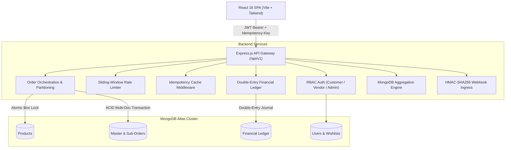

# MarketPulse — Multi-Vendor E-Commerce & Creator Marketplace

> **A modern, high-performance Multi-Vendor Marketplace platform built with the MERN Stack, featuring Neo-Brutalism & Cyber-Brutalism UI design, atomic inventory concurrency locking, multi-vendor order partitioning, visual carrier tracking, and instant payment methods.**

[](https://nodejs.org)
[](https://expressjs.com)
[](https://www.mongodb.com)
[](https://reactjs.org)
[](https://vitejs.dev)
[](https://tailwindcss.com)

---

## 📖 Table of Contents
- [Overview](#-overview)
- [Key Features](#-key-features)
- [Design System: Neo-Brutalism & Cyber-Brutalism](#-design-system-neo-brutalism--cyber-brutalism)
- [System Architecture](#-system-architecture)
- [API Reference](#-api-reference)
- [Seeded Accounts](#-seeded-accounts)
- [Local Setup & Installation](#-local-setup--installation)
- [Deployment Guide](#-deployment-guide)

---

## 🌟 Overview

**MarketPulse** connects independent creators, studios, and hardware brands with shoppers in a unified e-commerce experience. 

Customers can add products from multiple distinct vendor stores into a single cart and check out in one transaction. The platform automatically partitions the order into independent vendor sub-orders, assigns tracking numbers, routes payouts according to platform take-rate commissions, and maintains an immutable double-entry financial ledger.

---

## 🚀 Key Features

### 🛍️ 1. Customer Storefront & Catalog
* **Multi-Faceted Search & Filters**: Search by keywords, categories (*Electronics, Audio, Workspace, Peripherals*), price sliders, and in-stock status.
* **Dedicated Vendor Storefront Pages**: Click any creator or merchant badge to visit their dedicated store profile (`/stores/:slug`), view store ratings, bio, direct warranty guarantees, and store-specific catalog.
* **Product Reviews & Star Ratings**: Verified customer reviews with 1–5 star ratings, feedback comments, and real-time average star calculation.
* **Wishlist & Saved Items**: 1-click heart toggle on product cards to save items, view dedicated wishlist drawer, and move saved items directly to the cart.

### 💳 2. Multi-Method Checkout & Instant Free UPI
* **Unified Multi-Vendor Cart**: Combines items from multiple merchants with grouped sub-totals.
* **Instant Free UPI Gateway**: Dynamic UPI intent link (`upi://pay?...`) with real-time rendered QR code and VPA address verification.
* **Credit / Debit Cards**: Secure formatted card inputs (Card Number, Expiry, CVV).
* **Cash on Delivery (COD)**: Complete checkout with payment collected upon delivery.

### 📦 3. Visual Order Tracking & Self-Service Cancellation
* **4-Stage Visual Progress Stepper**: Live tracking states (`Order Placed` ➔ `Processing` ➔ `In Transit` ➔ `Delivered`).
* **Live Carrier Tracking Sync**: Integrated courier tracking numbers (*FedEx, DHL, Courier Express*) and estimated delivery date calculations.
* **Atomic Order Cancellation**: 1-click customer cancellation for eligible unshipped orders with automated inventory restoration and double-entry ledger refund reversal.

### 🏪 4. Vendor Management Portal
* **Store Performance KPIs**: Lifetime gross merchandise value (GMV), settled balances, pending dispatches, and active catalog listings.
* **Fulfillment Pipeline**: State machine transition buttons (*Start Packing ➔ Dispatch Carrier ➔ Mark Delivered*).
* **Product Publishing**: Modal to create new SKUs with custom pricing, compare-at discounts, stock counts, and tags.

### 📊 5. Platform Admin Console & Concurrency Lab
* **Financial Analytics**: MongoDB aggregation pipelines calculating platform commission take, vendor settlement payouts, and average order value (AOV).
* **Vendor Sales Leaderboard**: Real-time ranking of merchant stores by sales volume and fulfillment rate.
* **Concurrency Flash-Sale Sandbox**: Developer testing playground to execute 50 parallel checkout bursts against a shared SKU and verify atomic lock guards.
* **HMAC-SHA256 Webhook Ingress**: Timing-safe cryptographic signature verifier with tamper rejection testing.

---

## 🎨 Design System: Neo-Brutalism & Cyber-Brutalism

MarketPulse features a bespoke design system with support for both **Light Neubrutalism** and **Dark Cyber-Brutalism**:

* **Thick Black Outlines**: Solid `2.5px` and `3px` pure black borders across all interactive cards, modals, and inputs.
* **Hard Zero-Blur Drop Shadows**: Solid black box shadows (`shadow-brutal-sm`, `shadow-brutal`, `shadow-brutal-xl`) with tactile hover/press elevation transitions.
* **Light Palette (Neubrutalism)**: Electric Periwinkle canvas (`#5B85FA`), Canary Yellow (`#FEF08A`), Bubblegum Pink (`#FF6B97`), and Cyber Mint (`#6EE7B7`).
* **Dark Palette (Cyber-Brutalism)**: Deep Obsidian canvas (`#090A10`), Midnight Slate surfaces (`#121522`), Neon Toxic Lime (`#00FF87`), Cyber Neon Yellow (`#FFE600`), and Hot Pink (`#FF2A85`).
* **1-Click Theme Switcher**: Prominently placed on the navigation bar and login screen with automatic `localStorage` persistence.

---

## 🏗️ System Architecture



---

## 📮 API Reference

All backend routes are prefixed with `/api/v1`:

| Method | Endpoint | Description | Auth Required |
| :--- | :--- | :--- | :--- |
| `POST` | `/api/v1/auth/register` | Register customer or vendor store | Public |
| `POST` | `/api/v1/auth/login` | Sign in with email and password | Public |
| `GET` | `/api/v1/auth/me` | Fetch active user profile & store | Bearer JWT |
| `POST` | `/api/v1/auth/wishlist/:id` | Toggle product in customer wishlist | Customer |
| `GET` | `/api/v1/products` | Search catalog with filters, sorting, and pagination | Public |
| `POST` | `/api/v1/products` | Create a new product listing | Vendor / Admin |
| `POST` | `/api/v1/products/:id/reviews` | Submit a verified 1–5 star review | Customer |
| `GET` | `/api/v1/stores/:slug` | Retrieve vendor storefront details and catalog | Public |
| `POST` | `/api/v1/orders` | Checkout cart with atomic stock reservation | Customer |
| `GET` | `/api/v1/orders/mine` | List customer orders and visual tracking state | Customer |
| `PATCH`| `/api/v1/orders/:id/cancel` | Cancel order, refund ledger, and restore stock | Customer |
| `GET` | `/api/v1/vendor/dashboard` | Vendor earnings and fulfillment pipeline | Vendor |
| `PATCH`| `/api/v1/vendor/orders/:orderId/suborders/:subOrderId/status` | Update fulfillment state & tracking | Vendor |
| `GET` | `/api/v1/analytics/platform` | Aggregate GMV, revenue, and store leaderboard | Admin |
| `POST` | `/api/v1/webhooks/payment` | HMAC-SHA256 verified payment event ingress | Signature Header |

> *A complete Postman collection is available at `public/marketpulse_postman_collection.json` with pre-configured requests and token scripts.*

---

## 👥 Seeded Accounts

The database comes pre-seeded with test accounts:

| Role | Email | Password | Access Details |
| :--- | :--- | :--- | :--- |
| **Super Admin** | `admin@marketpulse.io` | `Password123!` | Full Platform Hub, Aggregation Analytics & Concurrency Lab |
| **Tech Vendor** | `vendor.tech@marketpulse.io` | `Password123!` | Apex Robotics & Gear (10% Take-Rate) |
| **Artisan Vendor** | `vendor.artisan@marketpulse.io` | `Password123!` | Kuro Studio Crafted (12% Take-Rate) |
| **Customer** | `customer@marketpulse.io` | `Password123!` | Shopper Profile, Wishlist & Order History |

---

## 💻 Local Setup & Installation

### 1. Prerequisites
* **Node.js**: v18.0.0 or higher
* **npm**: v9.0.0 or higher
* **MongoDB**: Local instance or free MongoDB Atlas URI

### 2. Clone Repository & Install Dependencies
```bash
git clone https://github.com/Pranav-by/MarketPulse.git
cd MarketPulse

# Install root, backend, and frontend dependencies
npm run install:all
```

### 3. Environment Variables
Create a `.env` file in `backend/.env`:
```env
PORT=5000
NODE_ENV=development
MONGODB_URI=mongodb+srv://<username>:<password>@cluster0.lkee1f1.mongodb.net/marketpulse?retryWrites=true&w=majority
JWT_SECRET=marketpulse_jwt_super_secret_key_2026_production_grade
JWT_EXPIRES_IN=7d
JWT_REFRESH_SECRET=marketpulse_refresh_super_secret_key_2026_secure
JWT_REFRESH_EXPIRES_IN=30d
WEBHOOK_SECRET=whsec_marketpulse_hmac_sha256_mock_key_2026
CLIENT_URL=http://localhost:5173
```

### 4. Seed Database & Run Locally
```bash
# Seed initial categories, sample stores, and products
npm run seed

# Run backend (Port 5000) and frontend (Port 5173) concurrently
npm run dev
```

Open **http://localhost:5173** in your browser.

---

## 🌐 Deployment Guide

### Frontend Deployment (Vercel)
1. Import repository on **[Vercel](https://vercel.com)**.
2. Set **Root Directory** to `frontend`.
3. Set **Framework Preset** to `Vite`.
4. Add Environment Variable (Config):
   * `VITE_API_URL` = `https://your-backend-service.onrender.com/api/v1`
5. Click **Deploy**.

### Backend Deployment (Render / Koyeb / Railway)
1. Create a new **Web Service** on **[Render](https://render.com)** or **[Koyeb](https://koyeb.com)**.
2. Set **Root Directory** to `backend`.
3. Set **Build Command** to `npm install`.
4. Set **Start Command** to `npm start`.
5. Add the environment variables from `backend/.env`.
6. Deploy and copy your production backend URL into Vercel's `VITE_API_URL`.

---

## 📄 License
This project is open-source and licensed under the [MIT License](LICENSE).
